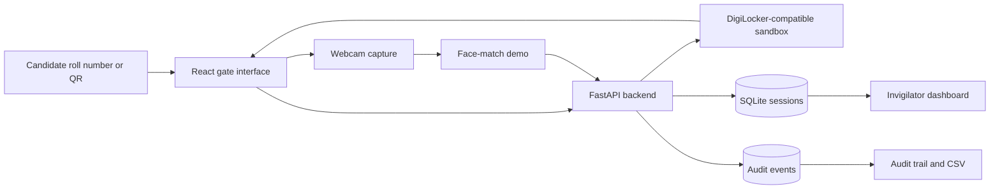

# ExamVerify

> DigiLocker-ready exam identity verification for secure, fast, and auditable exam-center entry.

ExamVerify is a full-stack hackathon prototype that fetches an official-format admit card, captures a live webcam signal, demonstrates face-match scoring, flags suspicious candidates, and records each decision in an audit trail.

## 🚀 Live Demo

**Deployed Application:**
https://exam-verify-khaki.vercel.app/

### Demo Credentials

| Roll number    | Candidate    | Expected result   |
| -------------- | ------------ | ----------------- |
| `JEE25BPL0042` | Rahul Sharma | Verified at 94.2% |
| `JEE25BPL0087` | Priya Verma  | Verified at 94.2% |
| `JEE25BPL0103` | Amit Patel   | Flagged at 61.3%  |

Unknown roll numbers return `DOCUMENT_NOT_FOUND`.

---

## Features

* DigiLocker-compatible admit-card sandbox
* Candidate verification workflow with webcam capture
* Verified and fraud demonstration cases
* Automatic low-confidence and repeated-attempt flags
* Live API activity console
* Invigilator dashboard with filters and search
* Append-only SQLite audit trail
* Audit severity filters and CSV export
* Responsive React interface
* FastAPI Swagger documentation

## Technology Stack

| Layer    | Technology                             |
| -------- | -------------------------------------- |
| Frontend | React 19, Vite 8, React Router, Lucide |
| Backend  | Python, FastAPI, Pydantic              |
| Database | SQLite                                 |
| Identity | DigiLocker-compatible sandbox payload  |
| Camera   | Browser MediaDevices API               |
| Testing  | Pytest, FastAPI TestClient             |

## Project Structure

```text
ExamVerify/
|-- backend/
|   |-- main.py
|   |-- requirements.txt
|   `-- test_api.py
|-- frontend/
|   |-- src/
|   |   |-- pages/
|   |   |-- api.js
|   |   |-- App.jsx
|   |   `-- styles.css
|   |-- .env.local
|   |-- package.json
|   `-- index.html
|-- demo/
|   |-- SCREENSHOTS.md
|   `-- VIDEO_SCRIPT.md
|-- presentation/
|   `-- ExamVerify-Hackathon-Pitch.pptx
|-- .gitignore
`-- README.md
```

## Main Pages

| URL          | Page                       |
| ------------ | -------------------------- |
| `/`          | Project landing page       |
| `/verify`    | Candidate verification     |
| `/dashboard` | Invigilator dashboard      |
| `/audit`     | Audit trail and CSV export |

## API Endpoints

| Method | Endpoint                          | Description                 |
| ------ | --------------------------------- | --------------------------- |
| `GET`  | `/health`                         | Backend health check        |
| `GET`  | `/digilocker/auth/status`         | Sandbox OAuth status        |
| `GET`  | `/digilocker/fetch/{roll_number}` | Fetch an admit card         |
| `POST` | `/verify/complete`                | Store a verification result |
| `GET`  | `/sessions`                       | Retrieve dashboard records  |
| `GET`  | `/stats`                          | Retrieve center statistics  |
| `GET`  | `/audit`                          | Retrieve audit events       |

## Architecture



## Local Development

### Backend

```powershell
cd backend
python -m pip install -r requirements.txt
python -m uvicorn main:app --host 0.0.0.0 --port 8000
```

### Frontend

Create `frontend/.env.local`

```env
VITE_API_URL=http://localhost:8000
```

Then run:

```powershell
cd frontend
npm install
npm run dev
```

Open:

```text
http://localhost:3000
```

## Testing

Backend tests:

```powershell
cd backend
python -m pytest -q
```

Frontend production build:

```powershell
cd frontend
npm run build
```

Current verification:

* Backend: 3 tests passing
* Frontend: production build passing
* npm audit: 0 known vulnerabilities at the time of verification

## Prototype Disclosure

This project is a sandbox prototype and does not claim production DigiLocker access, government approval, or certified biometric accuracy.

* DigiLocker responses are realistic sandbox records.
* Production OAuth requires approved organization credentials.
* Face confidence is deterministic for a repeatable demo.
* The webcam stream is displayed locally.
* No biometric image is uploaded or persisted by this prototype.
* A low score triggers review and should never be treated as proof of wrongdoing.

## Production Roadmap

1. Integrate approved DigiLocker OAuth and document APIs.
2. Validate issuer signatures and official document metadata.
3. Use an independently evaluated face-verification and liveness provider.
4. Add encryption, consent, retention, and deletion controls.
5. Add role-based access and cryptographically signed audit events.
6. Perform demographic fairness and threshold evaluations.
7. Support offline exam centers with secure synchronization.

## License

This repository is currently provided as a hackathon and educational prototype. Add an appropriate open-source license before public production reuse.
