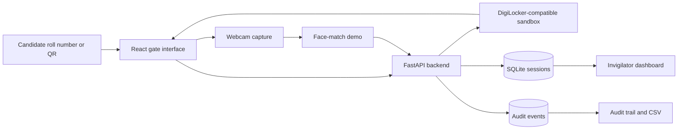

# ExamVerify

> DigiLocker-ready exam identity verification for secure, fast, and auditable exam-center entry.

ExamVerify is a full-stack hackathon prototype that fetches an official-format admit card, captures a live webcam signal, demonstrates face-match scoring, flags suspicious candidates, and records each decision in an audit trail.

## Features

- DigiLocker-compatible admit-card sandbox
- Candidate verification workflow with webcam capture
- Verified and fraud demonstration cases
- Automatic low-confidence and repeated-attempt flags
- Live API activity console
- Invigilator dashboard with filters and search
- Append-only SQLite audit trail
- Audit severity filters and CSV export
- Responsive React interface
- FastAPI Swagger documentation

## Technology Stack

| Layer | Technology |
|---|---|
| Frontend | React 19, Vite 8, React Router, Lucide |
| Backend | Python, FastAPI, Pydantic |
| Database | SQLite |
| Identity | DigiLocker-compatible sandbox payload |
| Camera | Browser MediaDevices API |
| Testing | Pytest, FastAPI TestClient |

## Project Structure

```text
ExamVerify/
|-- backend/
|   |-- main.py
|   |-- requirements.txt
|   `-- test_api.py
|-- frontend/
|   |-- src/
|   |   |-- pages/
|   |   |-- api.js
|   |   |-- App.jsx
|   |   `-- styles.css
|   |-- .env.local
|   |-- package.json
|   `-- index.html
|-- demo/
|   |-- SCREENSHOTS.md
|   `-- VIDEO_SCRIPT.md
|-- presentation/
|   `-- ExamVerify-Hackathon-Pitch.pptx
|-- .gitignore
`-- README.md
```

## Prerequisites

Install:

- Python 3.10 or newer
- Node.js 20 or newer
- npm
- A modern browser such as Chrome or Edge

## Run Locally

Use two terminals and keep both running.

### 1. Start the backend

```powershell
cd backend
python -m pip install -r requirements.txt
python -m uvicorn main:app --host 0.0.0.0 --port 8000
```

Verify:

- Health: [http://localhost:8000/health](http://localhost:8000/health)
- Swagger API: [http://localhost:8000/docs](http://localhost:8000/docs)

Expected health response:

```json
{"status":"ok","database":"examverify.db"}
```

### 2. Configure the frontend

Create `frontend/.env.local`:

```env
VITE_API_URL=http://localhost:8000
```

Do not add a path such as `/docs` or `/health`.

### 3. Start the frontend

```powershell
cd frontend
npm install
npm run dev
```

Open [http://localhost:3000](http://localhost:3000).

## Demo Candidates

| Roll number | Candidate | Expected result |
|---|---|---|
| `JEE25BPL0042` | Rahul Sharma | Verified at 94.2% |
| `JEE25BPL0087` | Priya Verma | Verified at 94.2% |
| `JEE25BPL0103` | Amit Patel | Flagged at 61.3% |

Unknown roll numbers return `DOCUMENT_NOT_FOUND`.

## Main Pages

| URL | Page |
|---|---|
| `/` | Project landing page |
| `/verify` | Candidate verification |
| `/dashboard` | Invigilator dashboard |
| `/audit` | Audit trail and CSV export |

## Make the Demo Public with VS Code

### 1. Start and forward the backend

Run:

```powershell
cd backend
python -m uvicorn main:app --host 0.0.0.0 --port 8000
```

In VS Code:

1. Open the **Ports** panel.
2. Forward port `8000`.
3. Set **Port Protocol** to `HTTP`.
4. Set **Port Visibility** to `Public`.
5. Copy the generated HTTPS address.

Test:

```text
https://YOUR-BACKEND-URL/health
```

### 2. Connect the frontend to the public backend

Set `frontend/.env.local` to the copied backend address:

```env
VITE_API_URL=https://YOUR-BACKEND-URL
```

Do not add `/docs`, `/health`, or another endpoint. A trailing slash is accepted, but omitting it is recommended.

Restart the frontend whenever `.env.local` changes:

```powershell
cd frontend
npm run dev
```

### 3. Forward the frontend

In the VS Code Ports panel:

1. Forward port `3000`.
2. Set **Port Protocol** to `HTTP`.
3. Set **Port Visibility** to `Public`.
4. Share the generated frontend URL.

VS Code and both terminal processes must stay running for the links to work.

## API Endpoints

| Method | Endpoint | Description |
|---|---|---|
| `GET` | `/health` | Backend health check |
| `GET` | `/digilocker/auth/status` | Sandbox OAuth status |
| `GET` | `/digilocker/fetch/{roll_number}` | Fetch an admit card |
| `POST` | `/verify/complete` | Store a verification result |
| `GET` | `/sessions` | Retrieve dashboard records |
| `GET` | `/stats` | Retrieve center statistics |
| `GET` | `/audit` | Retrieve audit events |

## Architecture



## Testing

Backend tests:

```powershell
cd backend
python -m pytest -q
```

Frontend production build:

```powershell
cd frontend
npm run build
```

Current verification:

- Backend: 3 tests passing
- Frontend: production build passing
- npm audit: 0 known vulnerabilities at the time of verification

## Troubleshooting

### Frontend shows `Not Found`

Confirm that `frontend/.env.local` contains only the backend base URL:

```env
VITE_API_URL=https://YOUR-BACKEND-URL
```

Restart the frontend after editing the file.

### Frontend page is blank

Port `5173` may be reserved on Windows. This project is configured to use port `3000`.

```powershell
npm run dev
```

Then open `http://localhost:3000`.

### Dashboard or audit does not load

Test these backend endpoints directly:

```text
http://localhost:8000/sessions
http://localhost:8000/audit
```

For a public demo, replace `localhost:8000` with the public backend address.

### Changes are not visible

Restart Vite and hard-refresh:

```text
Ctrl+C
npm run dev
```

Then press `Ctrl+Shift+R` in the browser.

## Prototype Disclosure

This project is a sandbox prototype and does not claim production DigiLocker access, government approval, or certified biometric accuracy.

- DigiLocker responses are realistic sandbox records.
- Production OAuth requires approved organization credentials.
- Face confidence is deterministic for a repeatable demo.
- The webcam stream is displayed locally.
- No biometric image is uploaded or persisted by this prototype.
- A low score triggers review and should never be treated as proof of wrongdoing.

## Production Roadmap

1. Integrate approved DigiLocker OAuth and document APIs.
2. Validate issuer signatures and official document metadata.
3. Use an independently evaluated face-verification and liveness provider.
4. Add encryption, consent, retention, and deletion controls.
5. Add role-based access and cryptographically signed audit events.
6. Perform demographic fairness and threshold evaluations.
7. Support offline exam centers with secure synchronization.

## License

This repository is currently provided as a hackathon and educational prototype. Add an appropriate open-source license before public production reuse.

