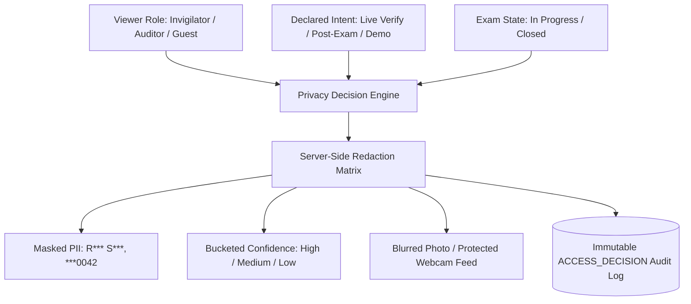

# ExamVerify — Context-Aware Privacy Control for Prediction Engine

> DigiLocker-ready exam identity verification with server-enforced **Context-Aware Privacy Control** governing biometric prediction outputs and candidate PII.

ExamVerify is a full-stack hackathon project that authenticates official admit cards from DigiLocker, captures a live webcam feed, performs face-match prediction scoring, flags anomalies, and logs immutable access decisions and verification events.

---

## 🏆 Round 2 Upgrade: Prediction Context-Aware Privacy Control

### The Problem
In standard verification engines, prediction outputs (face confidence score e.g. `94.2%`, admit card photos, candidate PII, and fraud flags) are uniformly exposed to anyone viewing the screen. In real-world exam centers and audits, this violates the **principle of least privilege (need-to-know)**:
- An **Invigilator at the gate** needs live operational data and webcam streams.
- An **Auditor reviewing compliance** needs historical records and scores, but must not access live gate cameras.
- A **Public Demo / Guest viewer** only needs proof that the workflow functions, without exposing real student PII or raw biometric distances.

### Our Solution
ExamVerify introduces a **Server-Side Context-Aware Privacy Control Layer** sitting directly on top of the verification and prediction engine. Visibility is deterministically evaluated using a 3D signal triad:

$$\text{Visibility Profile} = f(\text{Viewer Role} \times \text{Declared Intent} \times \text{Exam Window Context})$$


```mermaid
flowchart TD
    A[Viewer Role: Invigilator / Auditor / Guest] --> D[Privacy Decision Engine]
    B[Declared Intent: Live Verify / Post-Exam / Demo] --> D
    C[Exam State: In Progress / Closed] --> D
    D --> E[Server-Side Redaction Matrix]
    E --> F[Masked PII: R*** S***, ***0042]
    E --> G[Bucketed Confidence: High / Medium / Low]
    E --> H[Blurred Photo / Protected Webcam Feed]
    E --> I[(Immutable ACCESS_DECISION Audit Log)]
```

---

## 🛡️ Visibility Matrix (PRD Specification Section 6)

| Data Field | Invigilator + Live Verification (`exam_in_progress`) | Auditor + Post-Exam Review (`exam_closed`) | Guest / Demo Walkthrough | Mismatched Intent (e.g. Invigilator + Post-Exam during Active Exam) |
|---|---|---|---|---|
| **Candidate Name** | Full (`Rahul Sharma`) | Full (`Rahul Sharma`) | Masked (`R*** S***`) | Masked + Reason Shown |
| **Roll Number** | Full (`JEE25BPL0042`) | Full (`JEE25BPL0042`) | Masked (`***0042`) | Masked + Reason Shown |
| **Admit-Card Photo** | Shown (needed for gate check) | Shown | Blurred placeholder | Hidden |
| **Live Webcam Stream** | Shown (local feed) | Disabled (post-exam) | Never shown (protected) | Hidden |
| **Raw Confidence Score** | Full precision (`94.2%`) | Full precision (`94.2%`) | Bucketed (`High (≥85%)`) | Bucketed |
| **Decision** | Full (`VERIFIED` / `FLAGGED`) | Full | Full | Full |
| **Flag Reason Detail** | Full (`LOW_CONFIDENCE, MULTIPLE_ATTEMPTS`) | Full | Generic (`UNDER REVIEW`) | Generic (`UNDER REVIEW`) |
| **Audit Actor Identity** | Full (`AI_ENGINE`, `FRAUD_ENGINE`) | Full | Redacted (`REDACTED_ACTOR`) | Redacted |

---

## ✨ Key Presentation Features for Judges

1. **🔒 Zero-Leakage Server Enforcement**: All data redaction and score bucketing is computed on the FastAPI backend before sending JSON responses over the wire. (Judges can inspect the Network tab in DevTools to confirm raw PII never reaches unauthorized clients).
2. **⚡ Side-by-Side Live Privacy Diff View**: 1-click modal rendering the exact same candidate record under **Guest Mode** vs **Invigilator Mode** simultaneously, highlighting masked vs clear fields.
3. **🛡️ Interactive Privacy Rules Matrix Inspector**: Live table loaded from `GET /context/rules` featuring an interactive test bench where judges can simulate any signal triad and inspect computed profiles in real time.
4. **🔍 Inline Explainability Badges with Tooltips**: Every masked field has a lock badge (`🔒 Masked`, `🔒 Bucketed`) with hover/click tooltips explaining *why* the field was withheld according to the active policy.
5. **📜 "Access Decisions" Audit Trail**: `/audit` includes a dedicated filter for `ACCESS_DECISION` events capturing timestamps, actor roles, intents, resources, granted fields, and redacted fields.
6. **📥 Compliance CSV Export**: Export comprehensive audit ledgers including access decision trails.

---

## 🎯 2-Minute Judge Demo Script

1. **Step 1: Guest / Demo Mode on `/verify`**:
   - Select the 🟣 **Guest / Public Demo** preset on the top banner.
   - Enter `JEE25BPL0042` and fetch the admit card.
   - Point out: Candidate name is `R*** S***`, roll number is `***0042`, photo is blurred, and confidence score displays `High (≥85%)`.
   - Hover on the `🔒 Masked` badge to show the explainability tooltip.
   - Show the API Console to demonstrate that raw PII is stripped in the network response.
2. **Step 2: Instant 1-Click Context Switch**:
   - Click the 🟢 **Invigilator @ Gate** preset in the persistent banner.
   - Notice the record instantly unmasks full name (`Rahul Sharma`), clear admit photo, and exact `94.2%` confidence score without page reload.
3. **Step 3: Live Privacy Diff View**:
   - Click **"⚡ Live Privacy Diff"** in the top bar.
   - Show the side-by-side comparison between Guest Mode and Invigilator Mode for candidate `JEE25BPL0042` and `JEE25BPL0103`.
4. **Step 4: Mismatched Context Defense**:
   - Click the ⚠️ **Mismatched Intent Test** preset (`invigilator` + `post_exam_review` during `exam_in_progress`).
   - Show the warning banner and how defensive data minimization activates automatically with contextual explanation.
5. **Step 5: Audit Trail & Privacy Evidence**:
   - Navigate to `/audit` and filter by **"🛡️ Access Decisions (Privacy)"**.
   - Show that every single context switch and candidate access is immutably logged with granted and redacted field lists.
   - Click **"Export CSV"** to demonstrate complete chain of custody.
6. **Step 6: Privacy Rules Matrix**:
   - Click **"🛡️ Rules Matrix"** to show judges the inspectable rule engine and interactive sandbox evaluator.

---

## 🧪 Testing & Verification

### Automated Backend Test Suite (8/8 Passed)
```powershell
cd backend
python -m pytest -v
```

* `test_health`: API and Privacy Engine health check.
* `test_digilocker_success_and_missing_document`: Tests admit card lookup and 404 handling.
* `test_guest_context_redacts_prediction_and_identity_data`: Tests Guest PII masking (`R*** S***`, `***0042`), score bucketing (`High (≥85%)`), and photo redaction.
* `test_auditor_post_exam_review_context`: Tests Auditor access rules (full records, disabled live webcam).
* `test_mismatched_intent_triggers_defensive_minimization`: Tests defensive minimization on context mismatch.
* `test_context_session_registration_and_audit_logging`: Tests `POST /context/session` and access decision audit trails.
* `test_get_context_rules`: Verifies rule matrix endpoint.
* `test_flagged_verification_is_persisted`: Verifies anomaly detection persistence.

### Production Frontend Build
```powershell
cd frontend
npm run build
```
✓ Production build passes with 0 lint or type errors.

---

## 🛠️ API Reference

| Method | Endpoint | Description |
|---|---|---|
| `POST` | `/context/session` | Register/switch viewer context (`role`, `intent`, `context`) & emit audit log |
| `GET` | `/context/session` | Retrieve active viewer context and computed visibility profile |
| `GET` | `/context/rules` | Inspect complete privacy redaction matrix and field rules |
| `GET` | `/digilocker/fetch/{roll_number}` | Fetch admit card with server-enforced contextual redaction |
| `POST` | `/verify/complete` | Commit biometric verification result & access decision log |
| `GET` | `/sessions` | Retrieve dashboard candidate sessions filtered/redacted by context |
| `GET` | `/audit` | Query append-only audit trail with `event_type=ACCESS_DECISION` filter |
| `GET` | `/stats` | Retrieve gate statistics including total access decisions logged |

---

## 🚀 Quickstart Local Development

### 1. Backend Setup
```powershell
cd backend
python -m pip install -r requirements.txt
python -m uvicorn main:app --host 0.0.0.0 --port 8000 --reload
```

### 2. Frontend Setup
```powershell
cd frontend
npm install
npm run dev
```
Open `http://localhost:3000` or `http://localhost:5173`.
